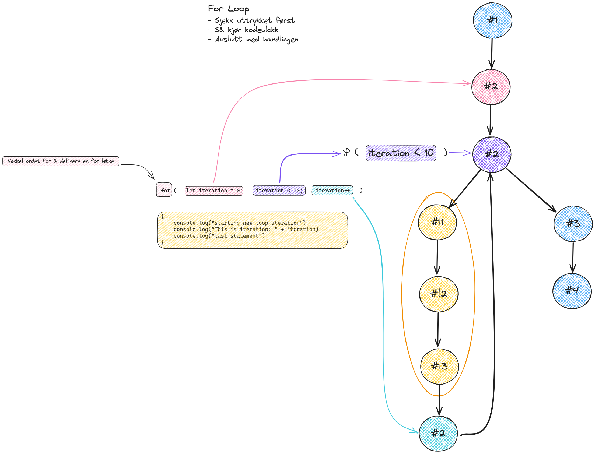

# Lister, Løkker og Objekter

Her er noen eksempler på litt mer avanserte måter å lagre data på. Litt mer formelt så er dette det som går under [Data Strukturer](https://en.wikipedia.org/wiki/Data_structure) og vi benytter oss av veldig mange forskjellig løsninger når vi skal designe systemer.

## Innhold

- [Lister/Array](#listerarray)
- [Objekter](#objekter)
- [Løkker](#løkker)

## Lister/Array

I JavaScript kalles lister for Array.
Noe som en må notere seg er at i de fleste programerings språk så begynner vi å telle plassen til elementene i listen på 0 (såkalt *zero-indexed*). Det kommer fra at datamaskiner teller i bits ( 0 og 1 ).

```js
let score = [ 1, 3, 4, 5]

let persons = [
  "Jane",
  "Don",
  "Mira",
  "Agathe",
  "Kent",
]

// Bruk hele listen
console.log(persons)

// Bruk et element fra listen
console.log(persons[0])

// Få antall elementer i listen
console.log(persons.length)
```

### Referanser
- [MDN Array](https://developer.mozilla.org/en-US/docs/Web/JavaScript/Reference/Global_Objects/Array)

## Objekter

For å gruppere tilhørendes variabler sammen så kan vi benytte oss av objekter i JavaScript.

```js
// En avis artikkel kan bestå av flere variabler
let newsArticle = {
  title: "Doomsday is HERE!",
  imageUrl: "https://endoftheworld.com/2012.png",
  body: "Ai! The end is neigh! Yhee fools who steals riches from dragons!"
}

// Bruk hele elentet
console.log(newsArticle)

// Få tak i enkelt variabler
console.log(newsArticle.title)
```

### Referanser

- [MDN Objects](https://developer.mozilla.org/en-US/docs/Web/JavaScript/Reference/Global_Objects/Object)

## Løkker

En måte å repetere en blokk med kode flere ganger på.
Ofte brukt i forbindelse med lister, men du finner de og igjen i spill, budsjetter med mer.

```js
// Kjør blokken med kode 10 ganger
for (let iteration = 0; iteration < 10; iteration = iteration + 1)
{
  // Legg logikken du ønsker å repetere her
  console.log(iteration)
}

// Hvordan vi kan bruke de i forbindelse med lister (Array)
let figurere = [ "Per", "Pål", "Espen" ]

for (let i = 0; i < figurere.length; i++ )
{
  console.log(figurer[i])
}
```



### Referanser

- [MDN Loops](https://developer.mozilla.org/en-US/docs/Web/JavaScript/Guide/Loops_and_iteration)